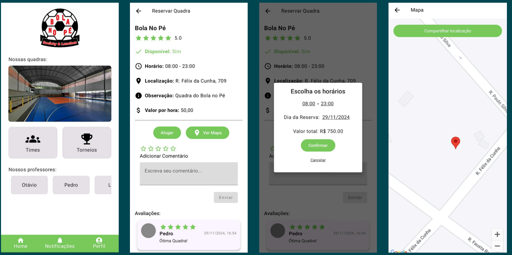
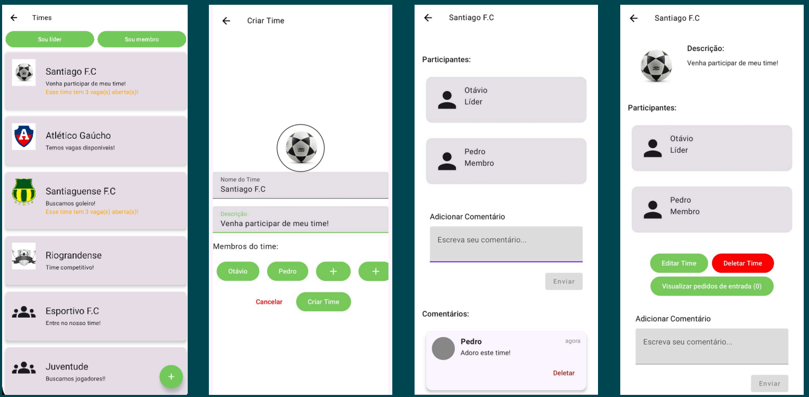
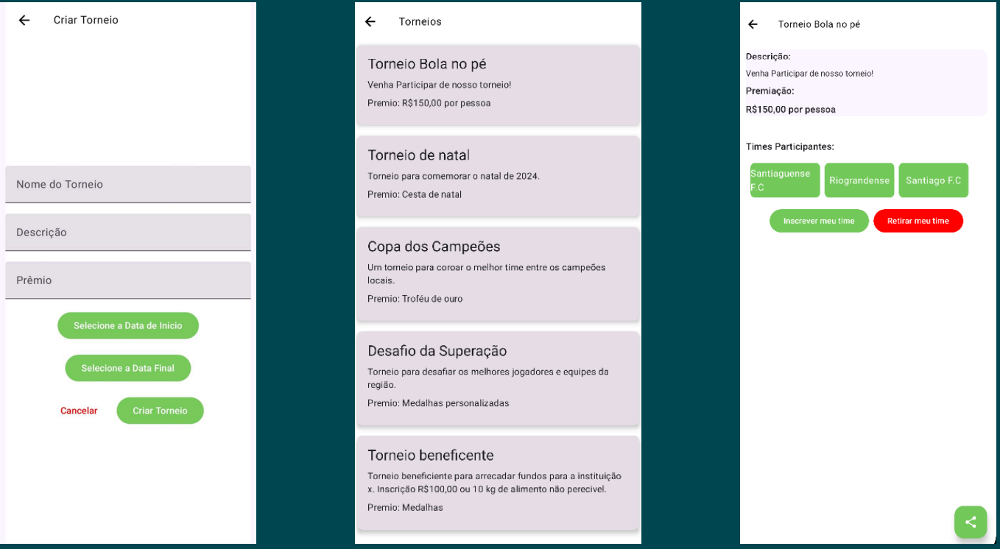
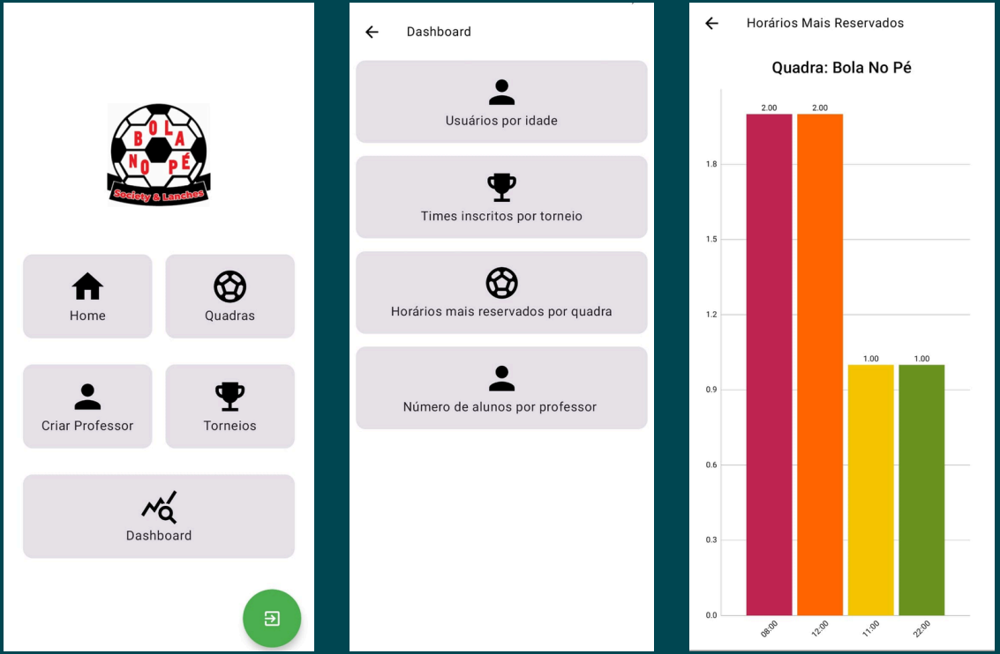

# Bola no pé⚽

O projeto consiste em uma aplicação para criação de times personalizados, marcar aulas, organizar torneios, conversar em fórum e reservar quadras de futebol afiliadas ao Bola no Pé.

Back-end do projeto acessivel em: https://github.com/picoliW/BolaNoPe-Back
## Features

| Feature                            | Estado |
| ---------------------------------- | ------ |
| Reserva de quadras                 | ✅     |
| Cadastro de usuários               | ✅     |
| Gerenciamento do admin             | ✅     |
| Criação e organização de times     | ✅     |
| Cadastro de Alunos                 | ✅     |
| Organização de torneios de futebol | ✅     |
| Comentários em times e quadras     | ✅     |

## Imagens

# Quadras

# Times

# Torneios

# Dashboard Admin

